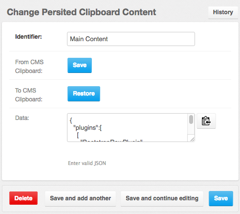

=================
The CMS Clipboard
=================

**DjangoCMS** offers a Clipboard where one can copy or cut and add a subtree of plugins to the DOM.
This Clipboard is very handy when copying plugins from one placeholder to another one, or to another
CMS page. In version 0.7.2 **djangocms-cascade** extended the functionality of this clipboard, so
that the content of the CMS clipboard can be persited to – and restored from the database. This
allows the site-administrator to prepare a toolset of plugin-trees, which can be inserted anywhere
at any time.

Persisting the Clipboard
========================

In the context menu of a CMS plugin, use **Cut** or **Copy** to move a plugin together with its
children to the CMS clipboard. In **Edit Mode** this clipboard is available from the primary menu
item within the CMS toolbar. From this clipboard, the copy plugins can be dragged and dropped to
any CMS placeholder which is allowed to accept the root node.

Since the content of the clipboard is overridden by every operation which cuts or copies a tree of
plugins, **djangocms-cascade** offers some functionality to persist the clipboard's content. To do
this, locate **Persited Clipboard Content** in Django's administration backend.

|persist-clipboard|

The **Identifier** field is used to give a unique name to the persited clipboard entity.

The **Save** button fetches the content from the CMS clipboard and persists it.

The **Restore** button replaces the content of the CMS clipboard with the current persisted entity.
This is the opposite operation of **Save**.

Since the clipboard content is serialized using JSON, the site administrator can grab and paste it
into another site using **djangocms-cascade**, if persisting clipboards are enabled.

Configuration
-------------

Persisting the clipboards content must be configured in the projects ``settings.py``:

.. code-block:: python

	INSTALLED_APPS = (
	    ...
	    'cmsplugin_cascade',
	    'cmsplugin_cascade.clipboard',
	    ...
	)

Caveats
-------

Only CMS plugins from the Cascade eco-system are eligible to be used for persisting. This is because
they already use a JSON representation of their content. The only exception is the **TextPlugin**,
since **djangocms-cascade** added some serialization code.
