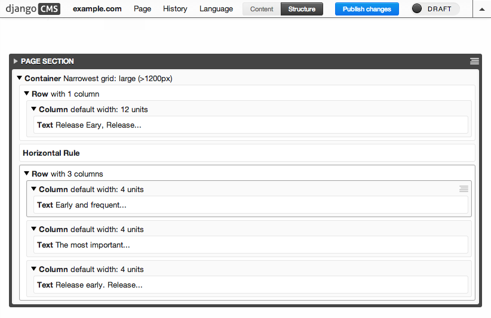
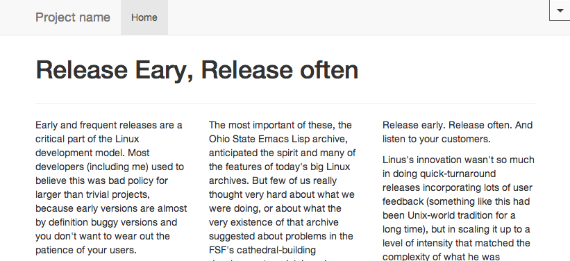

.. demo

Run the demo for DjangoCMS-Cascade
==================================

Prepare the environment. Assuming that you run Python in a `virtual environment`_ , make sure these
packages are installed::

	pip install django-filer cmsplugin-filer easy-thumbnails south djangocms-admin-style \
	    djangocms-text-ckeditor html5lib six Pillow django-polymorphic
	pip install -e git+https://github.com/divio/django-cms.git#egg=django-cms

Change into the directory ``examples`` and populate the database::

	./manage.py syncdb --migrate

Answer the questions about admin user, then start the Django development server::

	./manage.py runserver

As usual, this command shall only be used for development.

Point your browser onto http://localhost:8000/ and add a page to the CMS using the template
``Default Bootstrap Page``. This template contains a header with a menu bar, a footer and a single
DjangoCMS placeholder, named **PAGE SECTION**.

Start to populate this placeholder with the plugins **Container**, **Row** and **Column** found in
the context menus on the right hand sides. Use the plugin **Text** to insert a text field below a
**Column**.

|structure-demo|

After pressing the publish button, the single blocks are regrouped and displayed using the
Bootstrap's grid system.

|live-demo|

This gives you a small idea on the possibilities of this DjangoCMS extension.

.. _virtual environment: http://www.virtualenv.org/en/latest/
