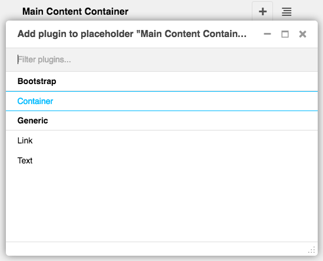

=================
For the Impatient
=================

This HowTo gives you a quick instruction on how to get a demo of **djangocms-cascade** up and
running. It also is a good starting point to ask questions or report bugs, since its backend is
used as a fully functional reference implementation, used by the unit tests of project.

Create a Python Virtual Environment
===================================

To keep environments separate, create a virtual environment and install external dependencies.
Missing packages with JavaScript files and Style Sheets, which are not available via pip must be
installed via npm:
Dependency packaging to made easy with Pipenv or Poetry.

.. code-block:: bash

	$ git clone --depth=1 https://github.com/jrief/djangocms-cascade.git
	$ cd djangocms-cascade/examples/
	$ python -m venv .venv 
	$ poetry shell
	$ poetry update
	
	Initialize the database, create a superuser and start the development server:

.. code-block:: bash

	$ cd examples
	$ npm install
	$ ./manage.py migrate
	$ ./manage.py createsuperuser
	$ ./manage.py runserver

Point a browser to http://localhost:8000/?edit and log in as the super user you just
created. Hit "next" and fill out the form to create your first page. Afterwards, click **Structure**
on the top of the page.  A heading named **Main Content** appears, it symbolizes our main
**django-CMS** Placeholder.

Locate the plus sign right to the heading and click on it. From its context menu select
**Container** located in the section **Bootstrap**:

|add-container|

This brings you into the editor mode for a Bootstrap container. To this container you may add one or
more Bootstrap **Rows**. Inside these rows you may organize the layout using some Bootstrap
**Columns**.

Please proceed with the detailled explanation on how to use the
:ref:`Bootstrap's grid <bootstrap3/grid>` system within **djangocms-cascade**.
