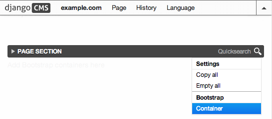

.. _impatient:

=================
For the Impatient
=================

This HowTo gives you a quick instruction on how to get a demo of **djangocms-cascade** up and
running. It also is a good starting point to ask questions or report bugs, since its backend is
used as a fully functional reference implementation, used by the unit tests of project.

Create a Python Virtual Environment
===================================

To keep environments separate, first create a *virtualenv*.

.. code-block:: bash

	#!/bin/sh
	sudo pip install --upgrade virtualenv
	virtualenv --distribute --no-site-packages myvirtualenv
	source myvirtualenv/bin/activate
	(myvirtualenv)$

Clone the latest stable releases
================================

Create a temporary file, for instance named requirements.txt, containing these entries:

.. code-block:: guess

	Django==1.7.10
	Django-Select2==5.2.1
	Pillow==2.9.0
	Unidecode==0.4.18
	django-classy-tags==0.6.2
	django-cms==3.1.3
	django-filer==0.9.12
	django-treebeard==3.0
	django-polymorphic==0.7.1
	django-sass-processor==0.3.0
	django-sekizai==0.8.2
	djangocms-admin-style==0.2.8
	-e git+https://github.com/jrief/djangocms-bootstrap3.git#egg=djangocms-bootstrap3
	-e git+https://github.com/jrief/djangocms-cascade.git#egg=djangocms-cascade
	djangocms-text-ckeditor==2.6.0
	easy-thumbnails==2.2.1
	html5lib==0.9999999
	jsonfield==1.0.3
	six==1.9.0
	wsgiref==0.1.2

and install them into your environment:

.. code-block:: bash

	pip install -r requirements.txt

this will take a few minutes. After the installation finished, change into the folder containing
the demo application, install missing CSS and JavaScript files, initialize the database and
create a superuser:

.. code-block:: bash

	cd $VIRTUAL_ENV/src/djangocms-cascade
	bower install --require
	cd examples
	./manage.py migrate --settings=bs3demo.settings
	./manage.py runserver --settings=bs3demo.settings

Point a browser onto http://localhost:8000/ and log in as the super user. Here you should be able
to add your first page. Do this by changing into into **Structure** mode on the top of the page.
Now a large dark bar named ``MAIN CONTENT CONTAINER`` appears. This bar symbolizes a **djangoCMS**
Placeholder.

Locate the menu handle |pull-down| on the right of the bar. From its context menu select
**Container** located in the section **Bootstrap**:

|add-container|

.. |pull-down| image:: _static/pull-down.png

This brings you into the editor mode for a Bootstrap container. To this container you may add one or
more Bootstrap **Rows**. Inside these rows you may organize the layout using some Bootstrap
**Columns**.

Please proceed with the detailled explanation on how to use the
:ref:`Bootstrap's grid <bootstrap3/grid>` system within **djangocms-cascade**.
