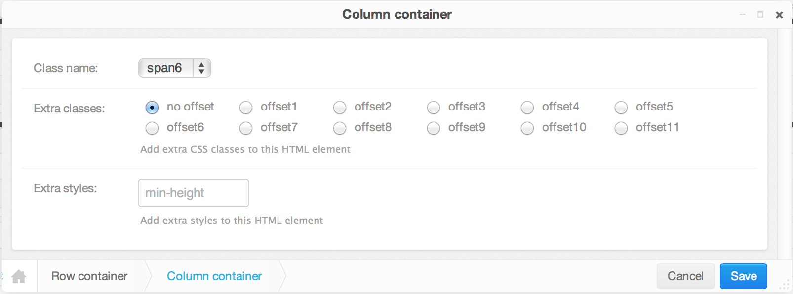

.. djangocms-bootstrap documentation master file

Welcome to djangocms-bootstrap's documentation!
===============================================

`Twitter Bootstrap`_ is a well documented CSS framework which gives web designers lots of
possibilities to add a consistent structure to their pages. This collection of DjangoCMS plugins
offers some of these predefined HTML elements to web designers.

**DjangoCMS-Bootstrap** is a collection of CMS plugins, which can be used to manipulate the
structure inside any of the DjangoCMS_ ```` fields.

With this collection of plugins, a web designer with some basic understanding of the DOM_ and the
`Bootstrap grid system`_, can create structured web pages without having to fiddle with HTML
templates.

Example
-------
|column-editor|

DjangoCMS version 3.0
---------------------
Django CMS 3.0 introduced a new frontend editing system as well as a customizable Django admin skin.

In the new system, placeholders_ and their plugins_ are no longer managed in the admin site, but
only from the frontend. Now, these plugins can be nested giving the possibility to create plugins
inside other plugins. In addition, the system offer two editing views:

* content view, for editing the configuration and content of plugins.
* structure view, in which plugins can be added and rearranged.

In structure mode, each placeholder displays a pull down menu on its right side: |pull-down|. When
the users passes over this icon, a menu pulls out and offers a section of plugins named
**Bootstrap**. The kind of plugin depends on the configuration and the current plugin type.

.. note:: Not every **Bootstrap** plugin can be added as a child to another plugin.

Contents:

.. toctree::

  installation
  scaffolding
  buttons
  thumbnails
  add_plugins
  history

Indices and tables
==================

* :ref:`genindex`
* :ref:`modindex`
* :ref:`search`

.. _Django: https://www.djangoproject.com/
.. _DjangoCMS: https://www.django-cms.org/
.. _Twitter Bootstrap: http://getbootstrap.com/2.3.2/
.. _DOM: http://www.w3.org/DOM/
.. _placeholders: https://django-cms.readthedocs.org/en/latest/advanced/templatetags.html#placeholder
.. _plugins: https://django-cms.readthedocs.org/en/latest/getting_started/plugin_reference.html
.. _Bootstrap grid system: http://getbootstrap.com/2.3.2/scaffolding.html#gridSystem

.. |pull-down| image:: _static/edit-plugins.png
    :width: 48
