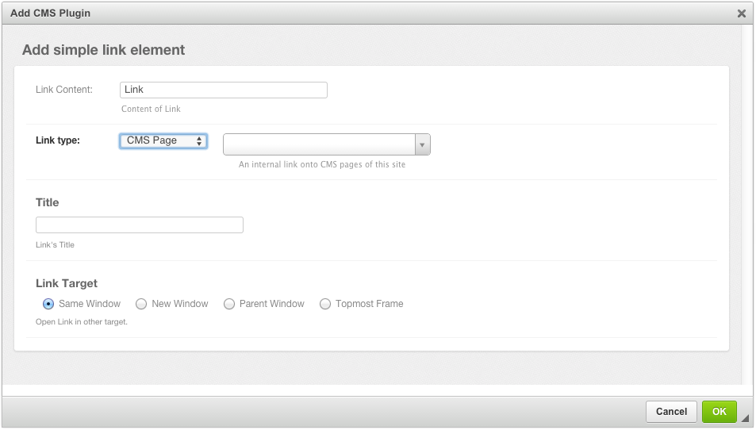
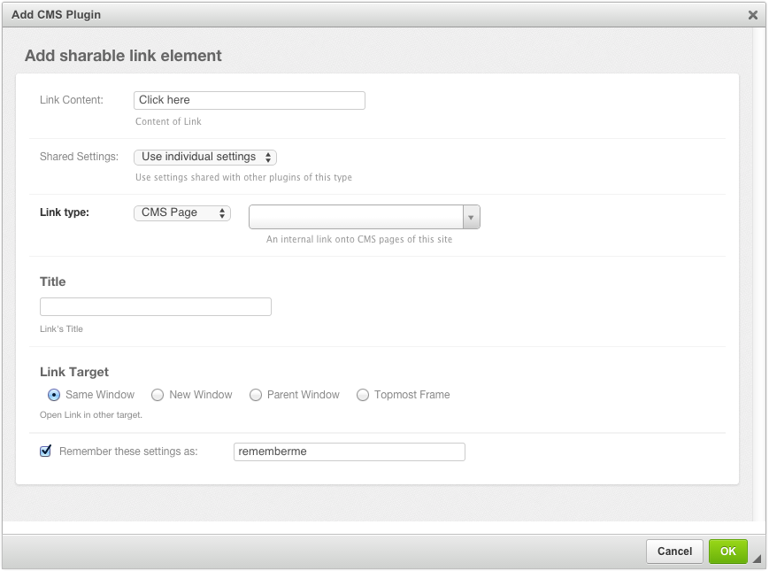

.. _link-plugin:

===========
Link Plugin
===========

**djangocms-cascade** ships with its own Link plugin. This is because other plugins from
**djangocms-cascade**, such as ButtonPlugin, ImagePlugin or PicturePlugin require the functionality
to set links to internal- and external URLs. The de-facto plugin for links, djangocms-link_ can't
be used as a base class for these plugins, therefore an alternative implementation has been
created. And as all other Cascade plugins, the LinkPlugin also keeps its data in a JSON field.

Before using this plugin, assure that ``'cmsplugin_cascade.link'`` is member of the list or
tuple ``CMSPLUGIN_CASCADE_PLUGINS`` in the project's ``settings.py``.

|simple-link-element|

The behavior of this Plugin is what you expect from a Link editor. The field **Link Content** is the
text displayed between the opening and closing ``<a>`` tag. If used in combination with
djangocms-text-ckeditor_ the field automatically is filled out.

By changing the **Link type**, the user can choose between three types of Links:

 * Internal Links pointing to another page inside the CMS.
 * External Links pointing to a valid Internet URL.
 * Links pointing to a valid e-mail address.

The optional field **Title** can be used to add a ``title="some value"`` attribute to the
``<a href ...>`` element.

With **Link Target**, the user can specify, whether the linked content shall open in the current
window or if the browser shall open a new window.

Link Plugin with sharable fields
================================

If your web-site contains many links pointing onto external URLs, you might want to refer to them
by a symbolic name, rather than having to reenter the URL repeatedly. With **djangocms-cascade**
this can be achieved easily by declaring some of the plugin's fields as “sharable”.

Assure that ``INSTALLED_APPS`` contain ``'cmsplugin_cascade.sharable'``, then redefine the
**TextLinkPlugin** to have sharable fields in ``settings.py``:

.. code-block:: python

	CMSPLUGIN_CASCADE = {
	    ...
	    'plugins_with_sharables':
	        ...
	        'TextLinkPlugin':  ('link',),  # and optionally other fields
	        ...
	    },
	    ...
	}

This will change the Link Plugin's editor slightly. Note the extra field added to the bottom of the
form.

|sharable-link-element|

Now the URL for this ink entity is stored in a central entity. This feature is useful, if for
instance the URL of an external web page may change in the future. Then the administrator can change
that link in the administration area once, rather than having to go through all the pages and check
if that link was used.

To retain the Link settings, click onto the checkbox *Remember these settings as: ...* and give it
a name of your choice. The next time your create a Shared Link element, you may select a previously
named settings from the select field *Shared Settings*. Since these settings can be shared among
other plugins, these input fields are disabled and can't be changed anymore.

Changing shared settings
------------------------

The settings of a shared plugin can be changed globally, for all plugins using them. To edit such a
shared setting, in the Django Admin, go into the list view for
**Home › Cmsplugin_cascade › Shared between Plugins** and choose the named shared settings.

Please note, that each plugin type can specify which fields shall be sharable between its plugins.
In this example, only the Link itself is shared, but one could configure **djangocms-cascade** to
also share the ``title`` and/or the link's ``target`` tags.

Then only these fields are editable in the detail view **Shared between Plugins**. The interface
for other shared plugin may vary substantially, depending of their type definition.

Extending the Link Plugin
=========================

While programming third party modules for Django, one might have to access a model instance through
a URL and thus add the method get_absolute_url_ to that Django model. Since such a URL is neither a
CMS page, nor a URL to an external web page, it would be convenient to access that model using a
special Link type.

For example, this special Link plugin is used by **djangoSHOP** to allow direct linking from a CMS
page to a shop's product.

.. literalinclude:: _static/shop_link_plugin.py
	:linenos:
	:language: python

When using this implementation, remember to change ``CMSPLUGIN_CASCADE_PLUGINS`` in your project's
``settings.py`` to that alternative Link plugin.

Now the select box for **Link type** will offer one additional option: “Product”. When this is
selected, the site administrator can choose between all of the shops products.

.. _djangocms-link: https://github.com/divio/djangocms-link
.. _djangocms-text-ckeditor: https://github.com/divio/djangocms-text-ckeditor
.. _get_absolute_url: https://docs.djangoproject.com/en/1.7/ref/models/instances/#get-absolute-url
