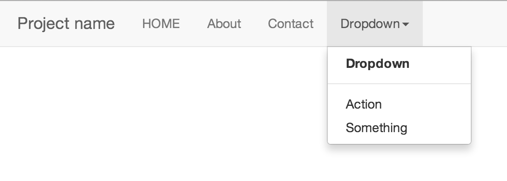
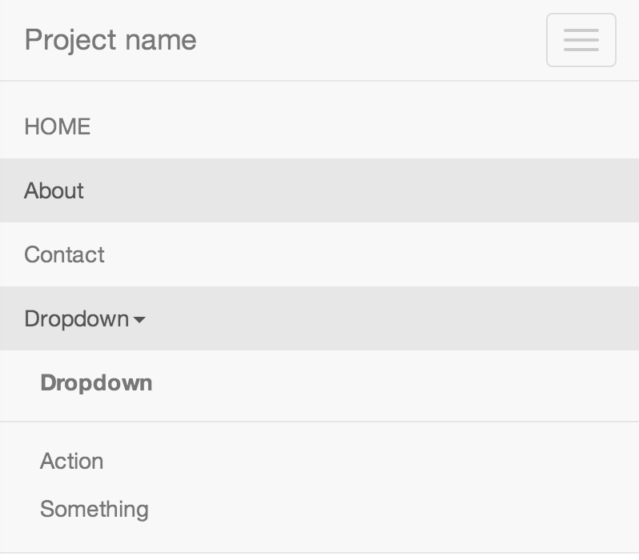

.. _navbar:

Styling the Main Menu
=====================
The DjangoCMS main menu can be perfectly integrated into a `Bootstrap Navbar`_. On large screens
this navbar then renders the DjangoCMS menu as a tree of nested drop-down items:

|navbar|

and on mobile screens:

|navbar-mobile|

Usage
-----
The main menu must be rendered by a *templatetag* and thus can not be used inside a placeholder_
tag. This makes it an exception for this library, which aims to be a collection of plugins for
DjangoCMS. 

To render the main menu in a navigation bar, use this HTML code::

	
	...
	

	    <ul class="nav navbar-nav"></ul>
	

Caveats
-------
In Bootstrap 3, sub-menus which appear on the mouse-over event, have been dropped. The caused a
`long and controversial discussion`_, but finally this feature has been removed. The main reason
for this decision is, that the mouse-over effect can not be handled on touch screens devices and
thus would force developers to create two different menus.

This for CMS users means, that clicking onto a menu item with children, now displays the sub-menu
rather than directing the user onto that named page. Therefore, menu items with children, are
displayed inside the drop-down menu for a second time, emphasizing their special meaning though.

.. _Bootstrap Navbar: http://getbootstrap.com/components/#navbar

.. _placeholder: http://django-cms.readthedocs.org/en/latest/advanced/templatetags.html?highlight=placeholder#placeholder
.. _long and controversial discussion: https://github.com/twbs/bootstrap/pull/6342#issuecomment-11594010
