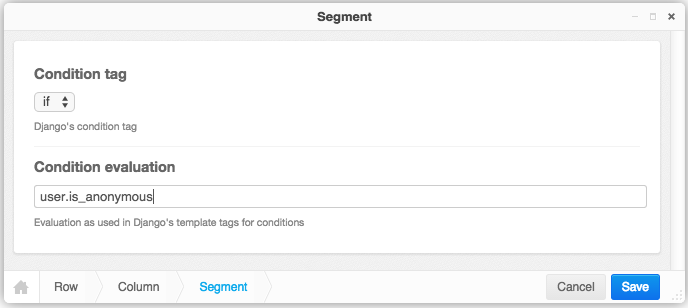

.. segmentation:

=======================
Segmentation of the DOM
=======================

The **SegmentationPlugin** allows to personalize the DOM structure, depending on various parameters
supplied with the Django request object. Some use cases are:

* Depending on the user, show a different portion of the DOM, if he is a certain user or not logged
  in at all.
* Show different parts of the DOM, depending on the browsers estimated geolocation. Useful to
  render different content depending on the visitors country.
* Show different parts of the DOM, depending on the supplied marketing channel.
* Show different parts of the DOM, depending on the content in the session objects from previous
  visits of the users.
* Segment visitors into different groups used for A/B-testing.

Configuration
=============

The **SegmentationPlugin** must be activated separately on top of other **djangocms-cascade**
plugins. In ``settings.py``, add to

.. code-block:: python

	INSTALLED_APPS = (
	    ...
	    'cmsplugin_cascade',
	    'cmsplugin_cascade.segmentation',
	    ...
	)

Then, depending on what kind of data shall be emulated, add a list of two-tuples to the
configuration settings ``CMSPLUGIN_CASCADE['segmentation_mixins']``. The first entry of each two-tuple
specifies the mixin class added the the proxy model for the ``SegmentationPlugin``. The second entry
specifies the mixin class added the the model admin class for the ``SegmentationPlugin``.

.. code-block:: python

	# this entry is optional:
	CMSPLUGIN_CASCADE = {
	    ...
	    'segmentation_mixins': (
	        ('cmsplugin_cascade.segmentation.mixins.EmulateUserModelMixin', 'cmsplugin_cascade.segmentation.mixins.EmulateUserAdminMixin',),  # the default
	        # other segmentation plugin classes
	    ),
	    ...
	}

Usage
=====

When editing **djangoCMS** plugins in **Structure** mode, below the section **Generic** a new plugin
type appears, named **Segment**.

|segment-plugin|

This plugin now behaves as an ``if`` block, which is rendered only, if the specified condition
evaluates to true. The syntax used to specify the condition, is the same as used in the Django
template language. Therefore it is possible to evaluate against more than one condition and combine
them with ``and``, ``or`` and ``not`` as described in `boolean operators`_ in the Django docs

Immediately below a segmentation block using the condition tag ``if``, it is possible to use the
tags ``elif`` or ``else``. This kind of conditional blocks is well known to Python programmers.

Note, that when rendering pages in djangoCMS, a RequestContext_- rather than a Context-object is used.
This RequestContext is populated by the ``user`` object if ``'django.contrib.auth.context_processors.auth'``
is added to your settings.py ``TEMPLATE_CONTEXT_PROCESSORS``. This therefore is a prerequisite
when the Segmentation plugin evaluates conditions such as ``user.username == "john"``.

.. _RequestContext: https://docs.djangoproject.com/en/1.8/ref/templates/api/#django.template.RequestContext
.. _boolean operators: https://docs.djangoproject.com/en/dev/ref/templates/builtins/#boolean-operators
.. _request object: https://docs.djangoproject.com/en/dev/ref/request-response/#httprequest-objects

Emulating Users
===============
As of version 0.5.0, in **djangocms-cascade** a staff user or administrator can emulate the
currently logged in user. If this plugin is activated, in the CMS toolbar a new menu tag appears
named “Segmentation”. Here a staff user can select another user. All evaluation conditions then
evaluate against this selected user, instead of the currently logged in user.

It is quite simple to add other overriding emulations. Have a look at the class
``cmsplugin_cascade.segmentation.mixins.EmulateUserMixin``. This class then has to be added to
your configuration settings ``CMSPLUGIN_CASCADE_SEGMENTATION_MIXINS``. It then overrides the
evaluation conditions and the toolbar menu.
