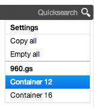
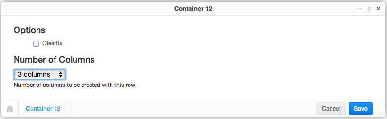
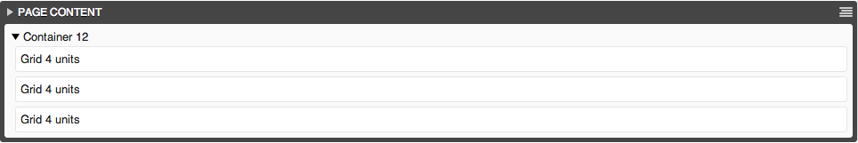
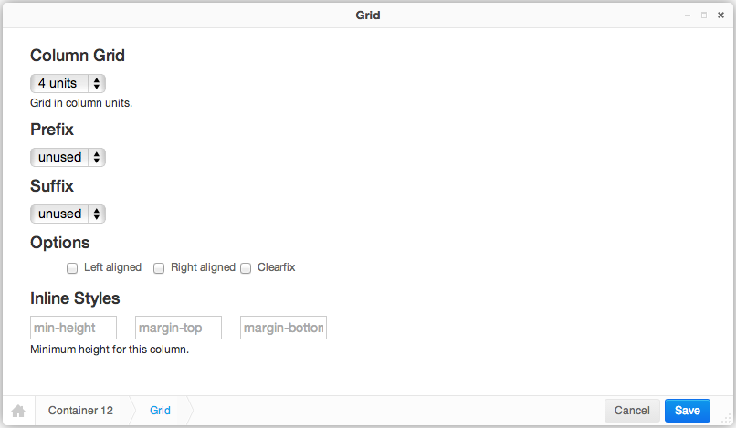

.. _tutorial-gs960:

Tutorial for Grid System 960
============================
This tutorial explains how to work with the `Grid System 960`_. Other CSS frameworks may
behave differently.

.. _Grid System 960: http://960.gs/

Frontend editing
----------------
Django CMS 3.0 introduced a new frontend editing system as well as a customizable Django admin skin.

In the new system, placeholders and their plugins are no longer managed in the admin site, but
only from the frontend. Now, these plugins can be nested giving the possibility to create plugins
inside other plugins. In addition, the system offer two editing views:

* **Content View**, for editing the configuration and content of plugins.
* **Structure View**, in which plugins can be added and rearranged.

Container
---------
In **Structure View** mode, each placeholder displays a pull down menu on its right top side:
|pull-down|. When the page editor passes over this icon, a menu pulls out and offers a section of
plugins named **960.gs**. The kind of plugin depends on the configuration and the current plugin
type. The first plugin to add is a container:

|add-container|

Use **Container 12** for a 12 column grid and **Container 16** for a 16 column grid. The container's
editor asks for the number of columns to be added. Choose a suitable number and click **Save**.
Now, for each chosen column, a **Grid** plugin is added automatically with the right width.

|edit-container|

.. _Stacked to Horizontal: http://getbootstrap.com/css/#grid-example-basic

Grid
----
While editing, one can specify the number of columns. If this is bigger than the current number of
columns, additional columns are added automatically. To delete columns, one must explicitly choose
the column in the context menu. Reducing the column count in the container's form editor, does not
work here.

|structure-container|

Double clicking on one of the **Grid** plugins, opens a Grid Editor. Here one can adjust the
grid's *width* and the *left* as well as the *right offset*.

If **Grid** plugins are nested, usually the margins have to be collapsed. This can be done by
activating the checkboxes named **Left aligned** and/or **Right aligned**. Activating **Clearfix**
adds the class ``clearfix`` to the grid's ``
`` element.

|edit-grid|

If you are not familiar with, please read the excellent tutorial_ on how to master the 960 Grid
System.

.. _tutorial: http://code.tutsplus.com/tutorials/mastering-the-960-grid-system--net-13794
