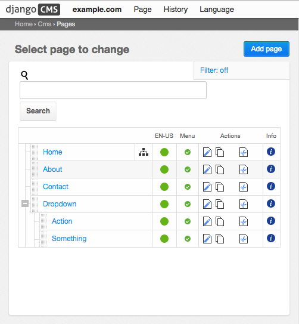

.. _tutorial-bs3:

========================
Tutorial for Bootstrap 3
========================

This tutorial explains how to work with `Twitter Bootstrap version 3`_. Other CSS frameworks may
behave differently.

.. _Twitter Bootstrap version 3: http://getbootstrap.com/

Frontend editing
================
Django CMS 3.0 introduced a new frontend editing system as well as a customizable Django admin skin.

In the new system, placeholders and their plugins are no longer managed in the admin site, but
only from the frontend. Now, these plugins can be nested giving the possibility to create plugins
inside other plugins. In addition, the system offer two editing views:

* **Content View**, for editing the configuration and content of plugins.
* **Structure View**, in which plugins can be added and rearranged.

Container
=========
In **Structure View** mode, each placeholder displays a pull down menu on its right top side:
|pull-down|. When the page editor passes over this icon, a menu pulls out and offers a section of
plugins named **Bootstrap**. The kind of plugin depends on the configuration and the current plugin
type. The first plugin to add is a container:

|add-container|

The containers editing form now asks for the minimum width, its underlying grid shall use. If you
need a grid system, which maintains all columns without stacking, independently of the display size,
then choose *Tiny*. Otherwise if columns shall align on larger display but stack on smaller ones,
then choose a larger breakpoint. For details read the section `Stacked to Horizontal`_ on the
Bootstrap's documentation site.

|edit-container|

To the container itself, one can for instance add a **Bootstrap Row**.

.. |pull-down| image:: _static/edit-plugins.png
.. |add-container| image:: _static/add-container.png
.. |edit-container| image:: _static/edit-container.png
.. _Stacked to Horizontal: http://getbootstrap.com/css/#grid-example-basic

Row
===
While editing, one can specify the number of columns. If this is bigger than the current number of
columns, additional columns are added automatically. To delete columns, one must explicitly choose
the column in the context menu. Reducing the column count in the row's form editor, does not work
here.

|edit-row|

Specifying the ``min-height`` in section **Inline Styles**, will add a style attribute to the
``
`` element, rendering the row, using the chosen minimum height. The height must be specified
in Pixels ``px`` or ``em``'s.

.. |edit-row| image:: _static/edit-row.png

Horizontal Rule
===============
A horizontal rule is used to separate rows optically from each other. The form editor accepts two
inline styles, to specify the top and the bottom margin for such a rule.

|rule-editor|

.. |rule-editor| image:: _static/rule-editor.png

Column
======
In the column editor, one can specify the width of each column. Since Bootstrap 3 this setting can
have more than one value, depending on the chosen display breakpoint.

|column-editor|

Since this may feel rather complicate, please refer to the corresponding Bootstrap documentation,
where the new `grid system`_ is explained detailed.

.. |column-editor| image:: _static/column-editor.png
.. _grid system: http://getbootstrap.com/css/#grid

Complete DOM Structure
======================
After having added a container with different rows and columns, you may add the leaf plugins. These
hold the actual content, such as text and images.

|structure-demo|

.. |structure-demo| image:: _static/structure-demo.png

After pressing the button **Publish changes**, the single blocks are regrouped and displayed using
the Bootstrap's grid system.

|live-demo|

.. |live-demo| image:: _static/live-demo.png

This gives you a small idea on the possibilities of this DjangoCMS extension.

Template tag for the Bootstrap3 Navbar
======================================
Although it's not derived from the ``CascadeElement`` class, this Django app is shipped with a
template tag to render the main menu inside a `Bootstrap Navbar`_. This tag is named ``main_menu``
and shall be used instead of ``show_menu``, as shipped with the DjangoCMS menu app.

.. _Bootstrap Navbar: http://getbootstrap.com/components/#navbar

Render a Navbar according to the Bootstrap3 guide:

.. code-block:: html

	
	...
	

	  

	    

	      <button type="button" class="navbar-toggle" data-toggle="collapse" data-target=".navbar-collapse">
	        Toggle navigation
	        
	        
	        
	      </button>
	      <a class="navbar-brand" href="/">Project name</a>
	    

	    

	      <ul class="nav navbar-nav"></ul>
	    

	  

	

Assume, the page hierarchy in DjangoCMS is set up like this:

|page-hierarchy|

then in the front-end, the navigation bar will be rendered as

|navbar|

.. |navbar| image:: _static/navbar.png

on computer displays, and as

|navbar-mobile|

.. |navbar-mobile| image:: _static/navbar-mobile.png

on mobile devices.

.. note:: Bootstrap3 does not support “hover”, since this event can't be handled by touch screens.
          Therefore the client has to click on the menu item, rather than moving the mouse cursor
          over it. In order to make CMS pages with children selectable, those menu items are
          duplicated. For instance, clicking on **Dropdown** in the Navbar, just opens the pull-down
          menu. Here the menu item for the page named “Dropdown” is rendered again. Clicking on this
          item, finally loads that page from the CMS.

.. note:: Bootstrap3 does not support nested menus, because they wouldn't be usable on mobile
          devices. Therefore the template tag ``main_menu`` renders only one level of children, no
          matter how deep the page hierarchy is in DjangoCMS.
