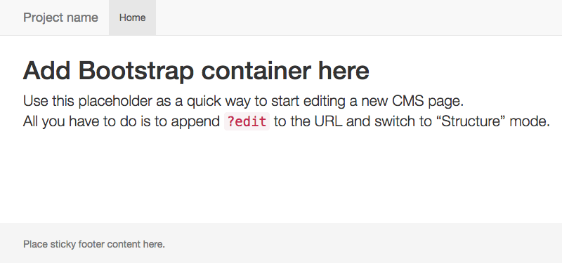
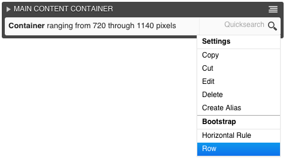
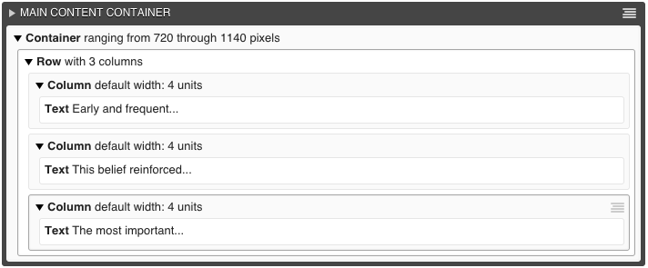

.. _tutorial-bs3:

========================================
Tutorial using the Bootstrap 3 framework
========================================

This tutorial gives a practical introduction to **djangocms-cascade**, using `Bootstrap 3`_ as CSS
framework.

.. _Bootstrap 3: http://getbootstrap.com/

Preable
=======
Django CMS 3.0 introduced a new frontend editing system as well as a customizable Django admin skin.

Here, placeholders and their plugins are no longer managed in the admin site, but only inside the
frontend. A great new feature in **djangoCMS** version 3 is, that plugins can be nested into each
other, allowing the user to design a page from scratch, without having to write HTML.

Run the demo
============

**djangocms-cascade** is shipped with a working demo for immediate testing. Using these
instructions, you should be able to set up a running instance in less than 5 minutes. First
checkout the sources from github:

.. code-block:: bash

	$ git clone https://github.com/jrief/djangocms-cascade.git

and change into that directory.

Prepare the environment
-----------------------
It is assumed that you run Python in a `virtual environment`_. To run this tutorial, it is strongly
recommended to create a new virtual environment:

.. code-block:: bash

	$ mkvirtualenv cascadedemo

Change into the directory ``examples`` and install the required dependencies:

.. code-block:: bash

	(cascadedemo)$ pip install -r bs3demo/requirements.txt

this take some time, as pip has to download quite a lot of third party packages.

.. _virtual environment: http://www.virtualenv.org/en/latest/

Populate the database
---------------------

.. code-block:: bash

	(cascadedemo)$ ./manage.py syncdb --migrate --settings=bs3demo.settings

here you'll be asked to create a superuser for the Django admin backend.

Start the demo server
---------------------

	(cascadedemo)$ ./manage.py runserver

and point a browser onto http://localhost:8000/ . You should see a blue page from django CMS. Log
in, and add your first page.

Boostrap Container
==================

An empty page should appear now:

|empty-container|

On the top of the page, change into **Structure** mode. Locate the context menu handle |pull-down|
on the right of the large dark bar named “MAIN CONTENT CONTAINER”. From this context menu select
**Container** located in the section **Bootstrap**:

|add-container|

.. |pull-down| image:: _static/pull-down.png
.. |add-container| image:: _static/add-container.png

This brings you into the editor mode for a Bootstrap container.

|edit-container|

.. |edit-container| image:: _static/edit-container.png
	:width: 800px

In the containers editor, you can change the narrowest and the widest breakpoint, the underlying
grid_ shall use. The default settings are the most flexible ones, so the best thing is to keep
these settings.

.. _grid: http://getbootstrap.com/css/#grid-example-basic

After saving, a container is added to the placeholder. As child of this container, you can now add
a row. In **Structure** view, the placeholder now displays a line symbolizing the newly added
container. On its right, this line adds a context menu handle. Select **Row** below the
**Bootstrap** section to add it to the container.

|add-row|

Bootstrap Row
=============
While editing, one can specify the number of columns. If this is bigger than the current number of
columns, additional columns are added automatically. To delete columns, one must explicitly choose
the column in the context menu. Reducing the column count in the row's form editor, does not work
here.

|edit-row|

Specifying the ``min-height`` in section **Inline Styles**, will add a style attribute to the
``
`` element, rendering the row, using the chosen minimum height. The height must be specified
in Pixels ``px`` or ``em``'s.

.. |edit-row| image:: _static/edit-row.png

Horizontal Rule
===============
A horizontal rule is used to separate rows optically from each other. The form editor accepts two
inline styles, to specify the top and the bottom margin for such a rule.

|rule-editor|

.. |rule-editor| image:: _static/rule-editor.png

Bootstrap Column
================
In the column editor, one can specify the width of each column. In Bootstrap 3, each column can
have different widths, depending on the chosen display breakpoint.

|column-editor|

Having so many options may feel rather complicate, so please refer to the corresponding Bootstrap
documentation, where the `grid system`_ is explained detailed.

.. |column-editor| image:: _static/column-editor.png
	:width: 800px
.. _grid system: http://getbootstrap.com/css/#grid

.. note:: By reducing the number of possible breakpoints in the container, this editor's layout
	changes and offers a smaller set of options.

Complete DOM Structure
======================
After having added a container with different rows and columns, you may add the leaf plugins. These
hold the actual content, such as text and images.

|structure-container|

By pressing the button **Publish changes**, the single blocks are regrouped and displayed using
the Bootstrap's grid system.

This gives you a small idea on the possibilities of this DjangoCMS extension.
